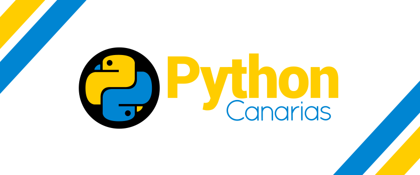

# Python Canarias

• Sitio Web de [Python Canarias](https://pythoncanarias.es/) 🚀 &nbsp; felizmente hecho con [Django](https://www.djangoproject.com/) •

---

## Tabla de contenido

- [Contribuyendo a este proyecto](CONTRIBUTING.md).
- [Configuración del entorno de desarrollo](docs/dev.md).
- [Configuración del entorno de producción](docs/prod.md).
- [Añadir una nueva app](docs/new-app.md).
- [API](docs/api.md).

## Licencia

Este proyecto esta disponible bajo la licencia [MIT](LICENSE.md).
